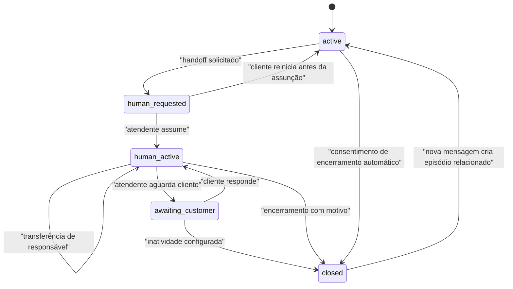
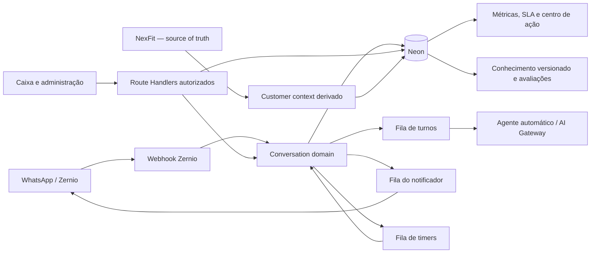
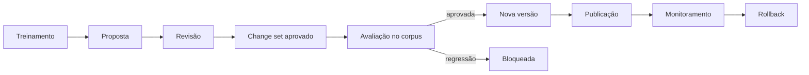

# Planejamento técnico da implantação — Conselho de elite ProHealth

**Data-base:** 20 de agosto de 2026  
**Responsável pela implementação:** Codex  
**Modelo de execução:** lotes por dependência e gates técnicos, sem estimativas em semanas.  
**Documentos de origem:**

- `docs/plano-acoes-conselho-elite-2026-08-20.md`
- `docs/plano-de-execucao-conselho-elite-2026-08-20.md`

## 1. Objetivo técnico

Evoluir a aplicação Next.js, Neon, Clerk, Vercel Queue, Zernio e AI Gateway já publicada sem reescrever a base, mantendo:

- NexFit como fonte de verdade operacional;
- Neon como memória própria, dados derivados, workflow e cache;
- Zernio como canal de WhatsApp;
- Clerk como identidade e autorização;
- Vercel Queue como execução durável e retentativa;
- APIs e migrações aditivas e retrocompatíveis;
- minimização de dados em eventos, métricas e notificações pessoais.

## 2. Restrições e decisões de arquitetura

### 2.1 Preservar a arquitetura atual

Não será criado um microsserviço novo. A aplicação continua organizada em:

- Route Handlers para entrada e mutações;
- módulos de domínio em `src/lib`;
- Neon para projeções e eventos persistentes;
- filas separadas por responsabilidade;
- Server Components para leituras e formulários pequenos;
- Client Components apenas onde houver interação local, foco, rascunho ou atualização em tempo real.

### 2.2 Estado canônico da conversa

Os estados principais continuam:

```text
active → human_requested → human_active → closed
```

“Aguardando cliente” será um subestado de `human_active`, identificado por `awaiting_customer_since` e pelo token de inatividade já existentes. Isso preserva ownership e impede o agente automático de responder durante atendimento humano.



`awaiting_customer` no diagrama é uma projeção de interface, não um novo valor da coluna `conversations.status`.

### 2.3 Concorrência

Toda mutação crítica usará:

- `UPDATE ... WHERE` com estado e responsável esperados;
- `assignment_version` crescente para detectar tela desatualizada;
- `FOR UPDATE SKIP LOCKED` para distribuição de fila;
- `idempotency_key` único para eventos e notificações;
- token para invalidar timers de SLA e inatividade antigos;
- transação única para projeção, evento de domínio e outbox quando possível.

### 2.4 Eventos e projeções

`conversations` continua como projeção rápida para a caixa. Um novo `conversation_events` registra mudanças estruturadas e auditáveis. Não será armazenado transcript nesse log.

Eventos previstos:

- `handoff_requested`;
- `assigned`;
- `assumed`;
- `transferred`;
- `awaiting_customer_started`;
- `awaiting_customer_cancelled`;
- `closed_human`;
- `closed_automatic`;
- `reopened`;
- `sla_warning`;
- `sla_breached`;
- `promise_created`;
- `promise_completed`;
- `survey_sent`;
- `survey_answered`.

`audit_logs` permanece para segurança e ação administrativa. `operational_metric_events` permanece para telemetria agregável. `conversation_events` passa a representar o histórico de domínio da conversa.

### 2.5 Feature flags e kill switches

Será criada uma tabela pequena `app_feature_flags` com:

- `key`;
- `enabled`;
- `config jsonb`;
- `updated_by_user_id`;
- `updated_at`.

Flags iniciais:

- `conversation_transfer`;
- `awaiting_customer`;
- `sla_engine`;
- `cx_surveys`;
- `promises`;
- `knowledge_publishing`;
- `new_app_shell`;
- `workforce_routing`.

Todas iniciam desativadas. A leitura terá cache curto em memória e falhará de forma segura para `false`.

## 3. Arquitetura-alvo



### Fronteiras de domínio

| Domínio | Diretório | Responsabilidade |
|---|---|---|
| Conversas | `src/lib/conversations` | estado, mensagens, reabertura, timers |
| Handoff | `src/lib/handoff` | assunção, transferência, encerramento |
| Atendentes | `src/lib/attendants` | perfil, turno, disponibilidade e capacidade |
| Notificações | `src/lib/notifications` | outbox, regras, entrega e reconciliação |
| SLA | `src/lib/sla` | calendário, políticas, prazo e projeção |
| CX | `src/lib/cx` | desfechos, pesquisas, FCR e reabertura |
| Promessas | `src/lib/promises` | compromisso, prazo e conclusão |
| Treinamento | `src/lib/training` | coleta e revisão de propostas |
| Conhecimento | `src/lib/knowledge` | versões publicadas, rollback e consumo |
| Avaliações | `src/lib/evaluations` | corpus ouro, execuções e gates |
| Métricas | `src/lib/metrics` | eventos, agregações e cobertura |
| NexFit | `src/lib/nextfit` | leitura oficial e normalização |

## 4. Sequência de migrações

As migrações serão aditivas. Nenhuma coluna ou tabela antiga será removida no mesmo release que introduzir a substituta.

### Aplicação no modelo atual do projeto

O repositório ainda não usa um framework de migrations durante o deploy. Portanto, cada evolução terá duas representações coerentes:

- arquivo SQL numerado em `migrations/`, como registro operacional e aplicação controlada;
- DDL idempotente na função `ensure...Schema` do domínio responsável, garantindo criação no primeiro uso em ambientes já conectados.

O teste de integração aplicará o arquivo SQL e depois executará a função `ensure...Schema` para provar que ambos são idempotentes. A consolidação futura em um runner único será tratada separadamente; não bloqueará os lotes funcionais nem introduzirá uma dependência agora.

### `0015_conversation_workflow.sql`

**Alterações**

- adicionar `conversations.assignment_version integer NOT NULL DEFAULT 0`;
- adicionar `conversations.awaiting_customer_by_user_id text`;
- adicionar `conversations.awaiting_customer_deadline_at timestamptz`;
- criar `conversation_events`;
- criar `app_feature_flags`;
- adicionar índices para responsável, subestado e fila;
- cadastrar flags desativadas.

**`conversation_events`**

```text
id uuid PK
conversation_id uuid FK
event_type text
actor_user_id text nullable
actor_label text nullable
from_user_id text nullable
to_user_id text nullable
reason_id text nullable FK
metadata jsonb com allowlist
idempotency_key text unique
occurred_at timestamptz
```

**Backfill**

- `assignment_version = 1` para conversas com responsável atual;
- nenhum evento histórico será inventado;
- registros anteriores permanecem consultáveis em `interaction_events` e `audit_logs`.

### `0016_notification_delivery_observability.sql`

**Alterações em `notification_outbox`**

- `recipient_user_id`;
- `conversation_id`;
- `template_name`;
- `external_message_id`;
- `cancelled_at`;
- `acknowledged_at`;
- novo estado `cancelled`.

**Nova tabela `notification_delivery_attempts`**

```text
id uuid PK
notification_id uuid FK
attempt_number integer
provider text
outcome pending|sent|failed
error_code text nullable
started_at timestamptz
finished_at timestamptz nullable
```

Nenhum telefone ou conteúdo de conversa será copiado para essa tabela.

### `0017_sla_engine.sql`

**Tabelas**

- `business_calendar_settings` — fuso, dias úteis e feriados/exceções;
- `sla_policies` — alvo por categoria, prioridade e tipo de prazo;
- `conversation_sla` — projeção atual por conversa;
- `sla_pause_events` — pausa e retomada com motivo.

**Campos principais de `conversation_sla`**

```text
conversation_id uuid PK
policy_id uuid FK
status normal|warning|breached|paused|completed
response_due_at timestamptz nullable
resolution_due_at timestamptz nullable
timer_token text
warning_emitted_at timestamptz nullable
breached_at timestamptz nullable
updated_at timestamptz
```

### `0018_outcomes_surveys_promises.sql`

**Tabelas**

- `conversation_outcomes` — um desfecho por episódio;
- `cx_surveys` — convite, amostragem, estado e deduplicação;
- `cx_survey_responses` — nota e comentário opcional;
- `conversation_promises` — responsável, prazo e status;
- `promise_events` — alterações auditáveis.

**Privacidade**

- survey não recebe cópia do transcript;
- comentário é opcional e possui retenção configurável;
- promessa armazena descrição operacional curta, não prontuário ou queixa clínica;
- métricas usam identificadores e categorias, não texto livre.

### `0019_knowledge_governance.sql`

**Evolução do treinamento**

- ampliar status de `training_sessions` sem perder registros existentes;
- criar `knowledge_change_sets`;
- criar `knowledge_change_items`;
- criar `knowledge_versions`;
- criar `knowledge_publications`;
- criar `knowledge_rollbacks`.

**Regra**

Uma sessão aprovada cria um change set, mas não altera produção. Somente uma publicação autorizada gera uma nova versão ativa.

### `0020_evaluation_and_workforce.sql`

**Tabelas**

- `evaluation_cases`;
- `evaluation_runs`;
- `evaluation_results`;
- `attendant_schedule_exceptions`;
- `attendant_presence`;
- `attendant_skills`;
- `attendant_capacity_settings`.

Os casos do corpus não armazenarão telefones, nomes reais ou identificadores NexFit.

## 5. Lote técnico A — transferência e Aguardando cliente

### 5.1 Camada de domínio

**Arquivos novos**

- `src/lib/handoff/transfer.ts` — validação e comando de transferência;
- `src/lib/handoff/transfer.test.ts` — regras e concorrência;
- `src/lib/conversations/workflow-events.ts` — gravação estruturada de eventos;
- `src/lib/conversations/awaiting-customer.ts` — início, cancelamento e timer;
- `src/lib/feature-flags/repository.ts` — flags seguras;
- `src/lib/feature-flags/types.ts`.

**Alterações**

- ampliar `HandoffStore` com `transferHandoff` e `setAwaitingCustomer`;
- implementar comandos no `NeonConversationRepository`;
- substituir eventos livres novos por `conversation_events`;
- manter gravação compatível nos eventos antigos onde os dashboards atuais dependam dela.

### 5.2 Contratos atômicos

#### Transferência

```ts
transferHandoff({
  conversationId,
  actorUserId,
  actorLabel,
  expectedAssignmentVersion,
  targetUserId,
  targetLabel,
  reasonId,
  note,
  idempotencyKey,
})
```

Condições SQL:

- conversa em `human_requested` ou `human_active`;
- ator é o responsável atual ou possui permissão administrativa;
- `assignment_version` é o esperado;
- destino existe, tem papel válido e está ativo;
- atualização incrementa `assignment_version`;
- evento e notificação são persistidos na mesma transação;
- conflito retorna HTTP `409`, nunca sobrescreve silenciosamente.

#### Aguardando cliente

```ts
setAwaitingCustomer({
  conversationId,
  actorUserId,
  expectedAssignmentVersion,
  enabled,
})
```

Ao habilitar:

- grava `awaiting_customer_since`, responsável, deadline e token;
- agenda mensagem em `prohealth-conversation-inactivity` se a política estiver ativa;
- emite evento `awaiting_customer_started`.

Ao receber mensagem do cliente:

- limpa deadline e token na mesma transação do inbound;
- emite `awaiting_customer_cancelled` com origem `customer_reply`;
- mantém `human_active` e ownership humano.

### 5.3 APIs

| Método e rota | Permissão | Entrada | Saída |
|---|---|---|---|
| `POST /api/handoff/[id]/transfer` | `handoff:transfer` | destino, motivo, nota, versão | `303` ou `409` |
| `POST /api/handoff/[id]/waiting` | `handoff:reply` | ação, versão | `303` ou `409` |
| `POST /api/profile/notification-test` | usuário autenticado | nenhuma | resultado seguro |
| `GET /api/profile/notification-status` | usuário autenticado | nenhuma | estado resumido |

Os formulários SSR continuarão usando `FormData`. Respostas JSON serão usadas apenas por Client Components que precisem preservar rascunho ou mostrar conflito sem recarregar.

### 5.4 Permissões

Adicionar:

- `handoff:transfer` — atendente, admin e owner;
- `handoff:force_transfer` — admin e owner;
- `operations:configure` — admin e owner;
- `notifications:test` — todos os papéis válidos.

Toda mutação continuará validando permissão no servidor mesmo com rota protegida pelo Clerk.

### 5.5 Interface

**`/handoff`**

- cabeçalho mostra estado, responsável e versão atual;
- ação “Transferir” abre `<dialog>` acessível;
- seletor lista atendentes ativos e seu estado de disponibilidade;
- motivo é obrigatório; nota é opcional;
- ação “Aguardar cliente” aparece somente para o proprietário atual;
- badge “Aguardando cliente desde…” usa dados persistidos;
- conflito `409` mantém o rascunho e oferece atualização da conversa;
- transferência e mudanças de estado aparecem como mensagens internas compactas.

**Proteção do rascunho**

- armazenar rascunho em `sessionStorage` por `userId + conversationId`;
- limpar somente após envio confirmado;
- não persistir rascunho no servidor;
- polling compara `assignment_version` antes de permitir envio.

### 5.6 Testes do lote A

- corrida de duas transferências: um vencedor;
- responsável antigo não envia após transferência;
- administrador força transferência com motivo;
- motivo inativo não pode ser usado em ação nova;
- inbound cancela timer de inatividade;
- timer antigo não fecha depois de uma resposta;
- nota e evento interno não chegam ao WhatsApp;
- rascunho sobrevive a `409` e atualização visual;
- navegação e diálogo funcionam por teclado.

## 6. Lote técnico B — notificador observável e SLA

### 6.1 Unificação da outbox

O `notifier-queue` deixa de transportar todos os dados da notificação e passa a transportar apenas:

```ts
{ notificationId: string }
```

Fluxo:

1. transação de domínio cria ou atualiza `notification_outbox`;
2. após commit, publica `notificationId` na Vercel Queue;
3. worker carrega o registro e revalida estado, destinatário e turno;
4. registra tentativa;
5. envia template Zernio com idempotência estável;
6. marca enviado, falhou, cancelado ou suprimido;
7. reconciliação periódica reenfileira registros pendentes sem tentativa ativa.

O cron permanece apenas como recuperação do intervalo entre commit no Neon e publicação na Queue.

### 6.2 Estado do notificador no perfil

Exibir:

- habilitado/desabilitado;
- telefone mascarado;
- em turno/fora do turno;
- próximo início de turno;
- status dos templates;
- último envio bem-sucedido;
- último erro categorizado;
- botão de teste com limite de frequência.

### 6.3 Motor de SLA

**Módulos novos**

- `src/lib/sla/calendar.ts`;
- `src/lib/sla/policies.ts`;
- `src/lib/sla/deadlines.ts`;
- `src/lib/sla/repository.ts`;
- `src/lib/sla/queue.ts`;
- testes correspondentes.

**Fila nova**

- tópico `prohealth-sla-deadlines`;
- mensagem `{ conversationId, timerToken, deadlineType }`;
- worker revalida token e estado antes de emitir alerta;
- mudança de estado gera novo token e torna timers anteriores inofensivos.

**Cálculo**

- função pura recebe início, minutos úteis, calendário e fuso;
- nenhuma dependência de `Date.now()` dentro da regra;
- feriados e exceções vêm de configuração persistida;
- cálculo e cobertura são testados com datas fixas.

### 6.4 Centro de ação

A listagem da inbox receberá campos projetados:

- `ownerScope`;
- `workflowState`;
- `slaStatus`;
- `nextDeadlineAt`;
- `actionPriority`;
- `notificationFailure`;
- `openPromiseCount`.

Ordenação padrão:

1. SLA vencido;
2. SLA em atenção;
3. sem responsável;
4. maior tempo aguardando;
5. atividade mais antiga.

Filtros e ordenações serão calculados no servidor para que paginação futura não altere o resultado.

## 7. Lote técnico C — desfechos, CX e promessas

### 7.1 Desfecho canônico

Toda transição para `closed` grava `conversation_outcomes` na mesma transação:

- origem humana, automática ou técnica;
- motivo estruturado;
- responsável;
- `started_at`, `closed_at`;
- tempos da equipe e do cliente;
- `reopened_from_conversation_id`;
- indicador de primeira resolução calculável.

FCR inicial:

```text
episódio encerrado sem novo episódio relacionado dentro da janela de medição
```

A janela será configuração explícita. Enquanto não definida, a plataforma mostra reabertura observada e não rotula FCR.

### 7.2 Pesquisa de experiência

**Fila** `prohealth-cx-survey`.

O fechamento elegível cria um registro `cx_surveys` com:

- token opaco;
- amostragem registrada;
- canal;
- `available_at`;
- `expires_at`;
- dedupe por episódio e tipo.

O agente envia uma pergunta por vez. A resposta inbound é roteada pelo token/estado da pesquisa antes do fluxo comercial. Opt-out tem precedência.

### 7.3 Promessas

**APIs**

- `POST /api/handoff/[id]/promises`;
- `POST /api/promises/[id]/complete`;
- `POST /api/promises/[id]/reschedule`;
- `POST /api/promises/[id]/cancel`.

**Fila** `prohealth-promise-deadlines` para lembretes e vencimentos com token invalidável.

Promessas abertas aparecem tanto na conversa quanto no centro de ação. Encerrar uma conversa não apaga promessa; exige concluir, cancelar ou manter como pendência atribuída.

## 8. Lote técnico D — conhecimento e avaliações

### 8.1 Pipeline de conhecimento



### 8.2 Artefato de conhecimento

O conhecimento atualmente definido em código será convertido gradualmente em um artefato versionado validado por schema. A runtime carrega apenas a versão marcada como ativa e mantém fallback para a versão embarcada no deploy.

Propriedades obrigatórias:

- identificador estável;
- categoria;
- afirmação;
- fonte e data de verificação;
- risco;
- regras de uso;
- autor e revisores;
- checksum da versão.

### 8.3 Publicação atômica

- gerar artefato candidato;
- validar schema;
- executar corpus ouro;
- bloquear se houver regressão crítica;
- inserir `knowledge_version` imutável;
- trocar ponteiro ativo em transação;
- invalidar cache;
- registrar publicação e auditoria;
- monitorar falhas e permitir rollback para versão anterior.

### 8.4 Corpus e gate

`npm test` continua para regras determinísticas. Será adicionado:

- `npm run test:integration` — Neon e transações;
- `npm run test:evaluation` — corpus ouro;
- `npm run test:e2e` — tarefas críticas de interface;
- `npm run verify` — lint + unit + integration + build.

Casos de IA não serão aprovados apenas por comparação literal. O scorecard avaliará precisão, segurança, ação confirmada, repetição, ordem, handoff e encerramento.

## 9. Lote técnico E — design system, acessibilidade e mobile

### 9.1 Estrutura

Criar:

- `src/components/ui` — componentes primitivos;
- `src/components/app-shell` — navegação e conta;
- `src/components/inbox` — lista, conversa e contexto;
- `src/styles/tokens.css` — tokens semânticos;
- `src/lib/ui/state-labels.ts` — vocabulário único.

Não será adicionada biblioteca visual grande se os componentes atuais puderem ser consolidados com React e CSS já instalados.

### 9.2 Atualização da caixa

Primeiro passo: polling com atualização seletiva que preserve foco e rascunho. Tempo real por serviço adicional somente será introduzido se medições mostrarem que polling não atende ao SLA de interface.

### 9.3 Testes E2E

Adicionar Playwright quando o Gate E começar, cobrindo:

- login e identificação da conta;
- assumir, responder, transferir e encerrar;
- conflito de ownership;
- rascunho preservado;
- navegação mobile;
- teclado e foco dos diálogos;
- estados vazios e falha de rede.

## 10. Lote técnico F — workforce e onboarding

### 10.1 Presença e disponibilidade

Disponibilidade efetiva:

```text
horário semanal
- exceção/ausência
- pausa ativa
+ cobertura temporária
```

`assignOnDutyAttendant` será substituído por um seletor puro e uma operação transacional que considere:

- permissão e conta ativa;
- disponibilidade efetiva;
- capacidade restante;
- competência necessária;
- última atribuição;
- maior espera da conversa.

### 10.2 Onboarding

Projeção de prontidão:

- conta aceita;
- papel válido;
- perfil criado;
- telefone validado;
- notificação testada;
- turno configurado;
- templates disponíveis;
- treinamento operacional concluído.

Usuário não pronto pode acessar o perfil, mas não entra na distribuição automática.

## 11. Estratégia de testes

### Unitários

- máquinas de estado;
- permissão;
- cálculo de calendário/SLA;
- deduplicação;
- classificação de desfecho;
- regras de pesquisa;
- avaliação de conhecimento.

### Integração com banco

Usar banco de teste separado por `TEST_DATABASE_URL` e schema efêmero:

- aplicar todas as migrações;
- testar comandos concorrentes;
- testar FK, unique e check constraints;
- testar rollback transacional;
- remover apenas o schema efêmero criado pelo teste.

### Contrato

- payloads Zernio com fixtures anonimizadas;
- templates e parâmetros;
- mensagens Vercel Queue;
- respostas e erros das Route Handlers;
- Clerk indisponível e permissão negada.

### E2E

- cenários críticos por papel;
- viewport desktop e mobile;
- acessibilidade automatizada complementada por revisão manual;
- concorrência simulada em duas sessões.

### Regressão obrigatória por lote

```text
npm run lint
npm test
npm run test:integration   # após sua criação
npm run test:evaluation    # após sua criação
npm run build
```

## 12. Observabilidade

### Eventos mínimos

- duração e resultado de cada comando;
- conflito de ownership;
- timer criado, invalidado e executado;
- notificação criada, enviada, falhou, cancelada e reconhecida;
- SLA em atenção e vencido;
- pesquisa enviada e respondida;
- promessa criada, cumprida e vencida;
- versão de conhecimento usada;
- resultado do corpus por versão.

### Logs

Permitido:

- IDs técnicos;
- nome da operação;
- status e código de erro sanitizado;
- duração;
- versão e tentativa.

Proibido:

- texto da conversa;
- telefone;
- conteúdo de survey ou promessa;
- credenciais;
- payload bruto da NexFit ou Zernio.

### Alertas

- fila sem consumo;
- taxa de falha de envio;
- outbox pendente acima do limite;
- SLA vencido sem responsável;
- timers atrasados;
- falha de migração;
- regressão crítica de avaliação;
- versão de conhecimento sem fallback válido.

## 13. Segurança e privacidade

- Clerk autentica; permissões da aplicação autorizam cada ação;
- toda rota mutável valida papel no servidor;
- admin não pode conceder `owner` pelas regras atuais;
- metadata segue allowlist;
- notas, comentários e promessas têm tamanho limitado;
- conteúdo clínico não entra em métricas ou WhatsApp secundário;
- telefone secundário fica mascarado na interface;
- retenção de comentários de CX será configurável;
- exclusões administrativas preservam histórico necessário por inativação;
- NexFit permanece somente leitura nos endpoints já suportados.

## 14. Estratégia de deploy e rollback

### Ordem por lote

1. migração aditiva;
2. código compatível com schema antigo e novo quando necessário;
3. deploy com feature flag desativada;
4. backfill verificável;
5. testes de produção sem dados inventados;
6. ativação para admin e atendente de teste;
7. validação operacional;
8. ativação geral;
9. monitoramento;
10. remoção futura de compatibilidade somente após releases posteriores estáveis.

### Rollback

- desativar a flag antes de reverter código;
- manter tabelas e colunas aditivas;
- invalidar timers pelo token, sem apagar filas amplamente;
- cancelar notificações pendentes pelo status;
- restaurar ponteiro de conhecimento para versão anterior;
- nunca usar `git reset --hard` ou exclusão destrutiva de dados de produção;
- migração destrutiva exige plano próprio e backup verificado.

## 15. Primeira unidade de implementação

O primeiro lote técnico executável contém:

1. `0015_conversation_workflow.sql`;
2. feature flags;
3. `conversation_events`;
4. `assignment_version`;
5. transferência atômica;
6. estado derivado “Aguardando cliente”;
7. APIs e permissões correspondentes;
8. diálogo de transferência;
9. proteção de rascunho;
10. testes unitários, integração de concorrência e fluxo crítico;
11. deploy com flags desativadas;
12. ativação controlada e verificação operacional.

### Critério de conclusão

- transferir nunca permite dois responsáveis;
- o responsável anterior perde permissão de envio imediatamente;
- uma resposta do cliente cancela inatividade pendente;
- conflito não apaga rascunho;
- eventos explicam toda mudança sem copiar transcript;
- testes, lint e build passam;
- rollback por flag foi testado.

## 16. Ordem técnica consolidada

1. workflow, eventos, flags, transferência e Aguardando cliente;
2. outbox observável e saúde do notificador;
3. calendário e motor de SLA;
4. centro de ação;
5. outcomes, reabertura e FCR;
6. CSAT/CES;
7. promessas;
8. conhecimento versionado e rollback;
9. corpus ouro e gates;
10. design system e shell;
11. acessibilidade e mobile;
12. workforce e onboarding.

Cada item só depende do anterior quando compartilha estado ou garantia. Trabalho de UI, testes e documentação dentro do mesmo lote pode avançar em paralelo.
